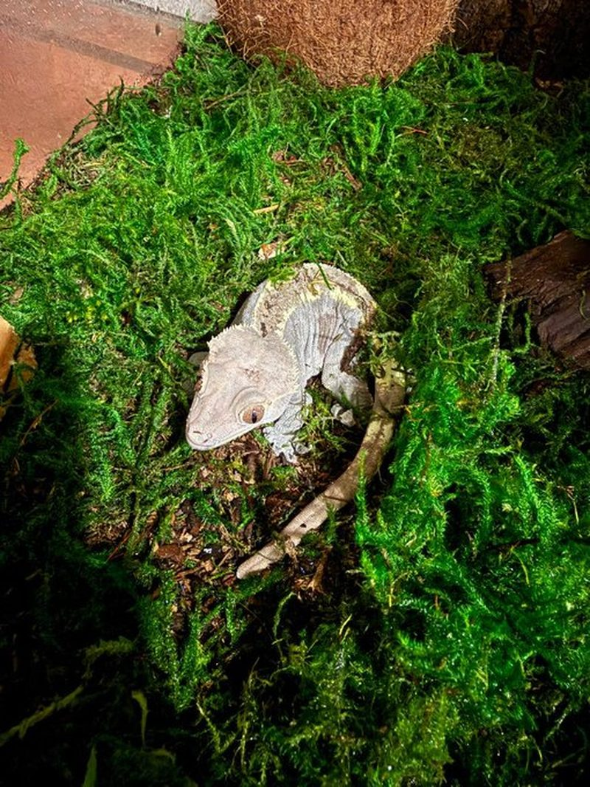

# Fotis

  

  *Fotis watches. Biscuit lives.*

  

  > Can a robot, on its own, look after a living creature?

  This repo is the brain and body of **Fotis**, a small Raspberry Pi robot
  that takes care of one crested gecko. The gecko is real. His name is
  **Biscuit**.

  Fotis watches Biscuit through a camera (infrared at night), reads the
  air with temperature and humidity probes, and asks **Grok 4.1 Fast**
  (xAI) what to do every minute. The model decides. Fotis executes.
  Biscuit lives his life. We write everything down.

  ## The story

  I wanted to know if a language model could keep something alive.

  Most AI demos run inside a text box. The agent picks a winning move,
  books a flight, writes a function. Nothing in the world actually
  changes. If the model is wrong, you close the tab. There is no animal
  on the other side.

  So we built one with an animal on the other side.

  Fotis is a Raspberry Pi with a camera and a small kit of parts: two
  temperature and humidity probes, a misting solenoid, a peristaltic pump
  that doses CGD (the fruit and insect powder cresties eat), a tiny servo
  that drops dusted crickets on insect nights, plant-grow lights and an
  IR illuminator. The brain is **Grok 4.1 Fast**, xAI's cheap vision-capable
  model, called once a minute. We hand it a photo of the tank, the current
  readings, the day or night phase and a short log of what Fotis just did.
  The model returns one of eight actions. Fotis runs it. A second later,
  the journal has a new line.

  This is not a chatbot pretending to care. The misting schedule is the
  model. The food cycle is the model. The watcher is the model. Fotis
  has hands. Grok has the plan. If the plan is wrong, real water and
  real food go into a real tank with a real animal in it. That is the
  whole point. We want to know where it breaks.

  A human checks on Biscuit in person every single day. Fotis can ask for
  help. Hard safety limits, especially the upper temperature limit, are
  enforced in code and never reach the model. Crested geckos die from
  heat faster than they die from anything else, and the safety layer
  reflects that.

  ## The plan

  The build runs in five phases. Each one has to pass before the next one
  starts.

  **Phase 1. Software in dry mode.** (Status: live.) Everything in this
  repo runs on a laptop with no hardware. The sensors return synthetic
  readings that drift slowly, the actuators just print what they would
  have done, and the brain still gets called for real. This lets us tune
  the prompt and watch the journal fill up before any wires touch a
  gecko.

  **Phase 2. Hardware on the bench.** Parts arrive. We wire up each piece
  in isolation: the DHT22 probes on their own, then the misting solenoid,
  then the CGD pump, then the lights, then the camera. Each one gets a
  small test script in `scripts/bringup/`. The mains side of anything
  plugged into a wall gets a fuse and an enclosure. Nothing goes near the
  tank until every part has been driven by Fotis once on the desk.

  **Phase 3. Empty tank rehearsal.** Fotis runs against the planted, fully
  wired tank for seventy two hours straight, with no gecko in it. We
  deliberately mess with it: open the doors, point a heater at it, empty
  the reservoir. We watch how fast Fotis corrects, what the model says in
  the journal, and whether the safety layer ever has to step in.

  **Phase 4. Move-in day.** Biscuit moves into the tank. For the first
  fourteen days Fotis runs under close supervision. A human is in the
  same room or on a live camera feed at all times. The journal is
  reviewed every evening. Anything weird gets flagged.

  **Phase 5. The actual experiment.** Fotis runs as the primary caretaker.
  A human still checks in person every day. We record everything for as
  long as the experiment runs. At the end we publish what we found, good
  and bad.

  ## How Fotis works

  Every minute, Fotis runs the same loop.

  ```
   ┌────────────────────┐
   │      Biscuit       │
   │  (crested gecko)   │
   └──────────┬─────────┘
              │
     look, read, think, act
              │
   ┌──────────▼─────────┐
   │       Fotis        │
   │   (Pi, Python)     │
   └──────────┬─────────┘
              │
              │  photo + readings + phase + history
              │
   ┌──────────▼─────────┐
   │  Grok 4.1 Fast     │
   │    (the brain)     │
   └──────────┬─────────┘
              │
              │  one structured action
              │
   ┌──────────▼─────────┐
   │  actuators + log   │
   │  + LCD display     │
   └────────────────────┘
  ```

  The action vocabulary is small.

  * `noop`. Do nothing. Used most of the time.
  * `mist`. Run the misting nozzle. Drives the humidity cycle.
  * `refresh_cgd`. Replace the CGD slurry in the food dish.
  * `offer_insect`. Drop one dusted insect (rare, evenings only).
  * `refill_water`. Run the water pump.
  * `set_lights`. Switch day, night or off.
  * `record_observation`. Log a behaviour note with no action.
  * `alert_human`. Ask a person to come look.

  That is the entire interface between the model and the world.

  ## Care for Biscuit

  Crested geckos are arboreal, nocturnal and temperate. They do not bask.
  Heat is the single biggest risk to them. Targets are in `config.yaml`:

  | Setting              | Day band       | Night band      |
  |----------------------|----------------|-----------------|
  | Ambient temperature  | 22 to 26 °C    | 18 to 22 °C     |
  | Humidity             | 50 to 70 %     | 80 to 100 %     |

  Diet is **CGD** (Pangea / Repashy / Black Panther Zoological style),
  mixed with water and offered in a small dish, replaced every 24 to 36
  hours. Live insects, dusted with calcium plus D3, are an occasional
  supplement at most one or two times per week. Crested geckos drink
  droplets from leaves after misting more than from a bowl.

  ## Safety

  These hard limits live in `src/safety.py` and bypass the model.

  | Hard limit                                | Value         |
  |-------------------------------------------|---------------|
  | Max ambient temperature                   | 28 °C         |
  | Min ambient temperature                   | 16 °C         |
  | Max misting per tick                      | 30 seconds    |
  | Max water pump per tick                   | 5 seconds     |
  | Max CGD refreshes per 24 hours            | 2             |
  | Max insects per 7 days                    | 8             |

  If ambient reads above 28 °C, the model is not even asked. Fotis alerts
  the human directly. If the model returns `mist` for a minute, the
  safety layer rewrites it to 30 seconds. The model can want what it
  wants. It cannot cook Biscuit.

  ## Repo layout

  ```
  FOTIS/
  ├── src/
  │   ├── main.py              tick loop: look, read, think, act, log
  │   ├── brain.py             Grok client (OpenAI-compatible) + JSON action parser
  │   ├── vision.py            Pi camera capture (real and dry)
  │   ├── display.py           LCD output
  │   ├── journal.py           append-only diary in JSON lines
  │   ├── safety.py            hard limits that bypass the model
  │   ├── sensors/             DHT22 probes plus water level switch
  │   ├── actuators/           mist, CGD pump, feeder, lights, water
  │   └── modules/             crested gecko specific helpers
  ├── prompts/system.md        Fotis's caretaker prompt
  ├── config.yaml              care targets, GPIO pins, model name
  ├── tests/
  │   └── test_safety.py       proves the safety layer behaves
  ├── scripts/
  │   ├── simulate_day.py      fast-forward dry mode, no API calls
  │   └── bringup/             Phase 2 hardware test scripts
  ├── docs/
  │   ├── EXPERIMENT.md        protocol, welfare rules, five phases
  │   ├── HARDWARE.md          wiring, parts list, BOM, build order
  │   ├── CRESTED_CARE.md      species reference: cresties in detail
  │   ├── WELFARE_CHECKLIST.md printable daily human check
  │   ├── EMERGENCY.md         vet contacts, first aid, what to do if
  │   └── SAMPLE_JOURNAL.md    what the diary is supposed to read like
  ├── data/                    journal and captured frames (gitignored)
  └── assets/                  fotis-ai.jpg, biscuit.jpg
  ```

  ## Setup

  Fotis runs on a Raspberry Pi 4 or 5 with Raspberry Pi OS. The software
  also runs from a Windows or Mac laptop in dry mode, which is how Phase
  1 is being developed.

  ```bash
  git clone https://github.com/jackd-brody/FOTIS.git
  cd FOTIS
  python -m venv .venv
  source .venv/bin/activate     # Windows: .venv\Scripts\activate
  pip install -r requirements.txt
  cp .env.example .env
  # put your XAI_API_KEY in .env, leave HARDWARE=dry for now
  ```

  Then start the loop:

  ```bash
  python -m src.main
  ```

  You should see Fotis boot, take a synthetic photo, sample fake sensor
  values, ask the model for a decision, and append the first line to
  `data/journal.jsonl`. After a few minutes the journal reads like a
  small diary of what Fotis chose and why.

  On the Pi, switch `HARDWARE=dry` to `HARDWARE=real` in `.env` to drive
  GPIO. Do not do this until Phase 2 is complete.

  ## Tests

  The safety layer is the only code whose job is to be wrong about the
  model. There are unit tests for it.

  ```bash
  pytest -q
  ```

  ## The simulator

  The simulator runs Fotis in dry mode at full speed, without calling the
  xAI API. It uses a deterministic stub brain that drives the day-night
  humidity cycle so the dry-mode pipeline (sensors, safety, journal) can
  be exercised free of charge.

  ```bash
  python scripts/simulate_day.py --ticks 1440      # one simulated day
  ```

  It writes to `data/simulated_journal.jsonl` and prints an action
  breakdown at the end.

  ## Bring-up scripts (Phase 2)

  Each piece of hardware gets its own small test script in
  `scripts/bringup/`. Run them on the Pi, one at a time, before letting
  Fotis drive anything.

  ```bash
  python scripts/bringup/test_dht22.py 4         # top probe
  python scripts/bringup/test_relay.py 18        # misting solenoid
  python scripts/bringup/test_servo.py 23        # insect feeder
  python scripts/bringup/test_camera.py          # capture one frame
  ```

  See [`docs/HARDWARE.md`](docs/HARDWARE.md) for the build order.

  ## Crested gecko modules

  `src/modules/` holds the crested gecko specific helpers Fotis uses on
  top of the core loop:

  | Module                  | What it does                                                |
  |-------------------------|-------------------------------------------------------------|
  | `humidity_cycler.py`    | Targets the day-night humidity cycle                        |
  | `misting.py`            | Misting schedule + cooldowns                                |
  | `cgd_feeding.py`        | CGD freshness tracker, recipe, dispense plan                |
  | `temperature_zones.py`  | Top + bottom probes, gradient health checks                 |
  | `night_vision.py`       | IR mode for nocturnal observation                           |
  | `day_night_cycle.py`    | What "now" means (day, dusk, night, dawn)                   |
  | `tail_health.py`        | Tail loss prevention, photo-based change detection          |
  | `shed_tracker.py`       | Shed cycle detection from camera frames                     |
  | `weight_log.py`         | Weekly weight CLI + trend                                   |
  | `behavior_log.py`       | Climb height + activity heatmap                             |
  | `calcium_schedule.py`   | Calcium plus D3 dusting reminders                           |
  | `vet_contacts.py`       | Emergency vet directory                                     |
  | `first_aid.py`          | Quick reference for common emergencies                      |
  | `metrics.py`            | Journal analyser: % in band, alerts per day, etc.           |
  | `baseline_controller.py`| Dumb rule-based controller for A vs B against Grok           |
  | `alerts.py`             | Tiered alerts: info, warn, urgent                           |

  See each file for usage.

  ## Status

  Phase 1 is live. The code in this repo runs end to end against fake
  sensors and a placeholder camera frame. The journal fills up. The brain
  behaves itself. Tests are green. The hardware is on order.

  Phase 2 starts when the parts arrive.

  ## Credits

  Private repo, owned by [@jackd-brody](https://github.com/jackd-brody).
  Shared with collaborators who are following the experiment.

  Follow along on X: [**@FotisCompanion**](https://x.com/FotisCompanion).
  